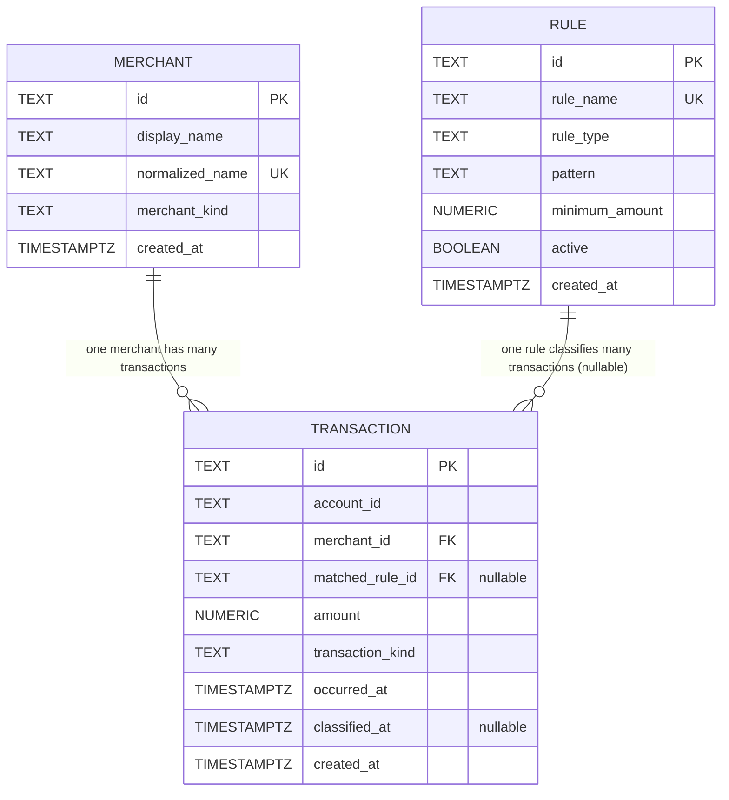

# Database schema (Week 2 Day 1)

This document describes the initial PostgreSQL schema for the `expense` schema.
Three tables are required for Week 2 Day 1: `expense.merchant`,
`expense.transaction`, and `expense.rule`.

## ER diagram

Cardinality summary:

- `expense.merchant` 1 --- many `expense.transaction` (every transaction
  references exactly one merchant; a merchant may have zero or many
  transactions).
- `expense.rule` 1 --- many `expense.transaction` (a transaction may
  reference zero or one matched rule; a rule may match many transactions).
- No many-to-many join table today --- the assignment requires exactly these
  three tables.

## Transaction record mapping

The Week 1 `com.uptimecrew.expense.model.Transaction` record maps onto the
new SQL tables as follows:

- `Transaction.id` -> `expense.transaction.id`
- `Transaction.accountId` -> `expense.transaction.account_id`
- `Transaction.amount` -> `expense.transaction.amount`
- `Transaction.merchantName` -> `expense.merchant.display_name` /
  `expense.merchant.normalized_name` (the Week 1 string is split into a
  human-readable `display_name` and a canonicalized `normalized_name` used
  for dedupe and rule matching)
- `Transaction.occurredOn` (a `LocalDate`) -> `expense.transaction.occurred_at`
  (stored as `TIMESTAMPTZ`; the date is the calendar-day component)
