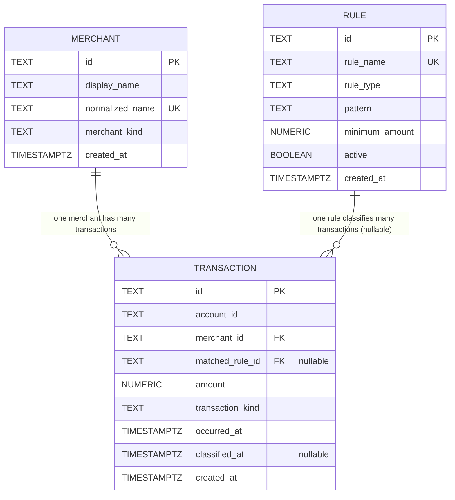

# Database schema (Week 2 Day 1)

This document describes the initial PostgreSQL schema for the `expense` schema.
Three tables are required for Week 2 Day 1: `expense.merchant`,
`expense.transaction`, and `expense.rule`.

## ER diagram



Cardinality summary:

- `expense.merchant` 1 --- many `expense.transaction` (every transaction
  references exactly one merchant; a merchant may have zero or many
  transactions).
- `expense.rule` 1 --- many `expense.transaction` (a transaction may
  reference zero or one matched rule; a rule may match many transactions).
- No many-to-many join table today --- the assignment requires exactly these
  three tables.

## Transaction record mapping

The Week 1 `com.uptimecrew.expense.model.Transaction` record maps onto the
new SQL tables as follows:

- `Transaction.id` -> `expense.transaction.id`
- `Transaction.accountId` -> `expense.transaction.account_id`
- `Transaction.amount` -> `expense.transaction.amount`
- `Transaction.merchantName` -> `expense.merchant.display_name` /
  `expense.merchant.normalized_name` (the Week 1 string is split into a
  human-readable `display_name` and a canonicalized `normalized_name` used
  for dedupe and rule matching)
- `Transaction.occurredOn` (a `LocalDate`) -> `expense.transaction.occurred_at`
  (stored as `TIMESTAMPTZ`; the date is the calendar-day component)

## Schema decisions

### expense.merchant

`expense.merchant` models a single known merchant. The Week 1
`Transaction.merchantName` string is split into `display_name` (the
human-readable label) and `normalized_name` (a canonical key used for
dedupe and rule matching). `id TEXT PRIMARY KEY` keeps the column type
consistent with the rest of the domain, and `normalized_name` carries a
`UNIQUE` constraint because the ingestion pipeline uses it as a natural
key. Both name columns have `length > 0` CHECK constraints so we can't
persist a blank merchant. `merchant_kind` is constrained by CHECK to
`('BUSINESS', 'PERSONAL', 'UNKNOWN')`. The foreign key from
`expense.transaction.merchant_id` uses `ON DELETE RESTRICT`: a merchant
with surviving transaction history cannot be deleted, which protects
historical facts from accidental cleanup.

### expense.rule

`expense.rule` persists the Week 1 classifier strategies as data instead
of code. `rule_name` is `UNIQUE` so each rule has a stable human-facing
identifier for logs and admin views. `rule_type` is constrained by CHECK
to the four strategy types we already implement
(`AMOUNT_THRESHOLD`, `MCC_CODE`, `MERCHANT_NAME`, `RECURRING_CHARGE`);
adding a new Java strategy requires a migration that extends this list.
`pattern` is `NOT NULL` with a `length > 0` CHECK because a rule with no
pattern can never match anything. `minimum_amount` is
`NUMERIC(12,2)` with a non-negative CHECK so monetary thresholds match
the domain rules already enforced in Java. `active BOOLEAN` lets us
retire a rule without deleting it. The foreign key from
`expense.transaction.matched_rule_id` uses `ON DELETE SET NULL`: when a
rule is removed, transactions it previously matched stay in place with a
null reference, so we preserve transaction facts while letting rules
evolve.

### expense.transaction

`expense.transaction` models the Week 1 `Transaction` record plus the
classification result. `id TEXT PRIMARY KEY` and `account_id TEXT NOT
NULL` (with a `length > 0` CHECK) reuse the application-provided
identifier scheme from Week 1. `merchant_id` is a required foreign key
to `expense.merchant(id)`; `matched_rule_id` is a nullable foreign key
to `expense.rule(id)`, expressing that a transaction may still be
unclassified or non-deductible. `amount NUMERIC(12,2)` with a
non-negative CHECK mirrors the Week 1 amount invariants.
`transaction_kind` is constrained by CHECK to
`('DEDUCTIBLE', 'NON_DEDUCTIBLE', 'UNCLASSIFIED')`. `occurred_at` is
`TIMESTAMPTZ NOT NULL`; `classified_at` is `TIMESTAMPTZ NULL` because
a transaction can be ingested before (or without) ever being classified.

## Local run

Run against a native PostgreSQL on macOS. The `psql postgres ...` form
below connects to the default `postgres` database on the local socket
— adjust the connection string if your setup differs.

```bash
psql postgres -f db/V1__schema.sql
psql postgres -f db/V2__seed.sql
psql postgres -f db/verify.sql
```

Inspect each table's columns, constraints, and defaults:

```bash
psql postgres -c "\d+ expense.merchant"
psql postgres -c "\d+ expense.rule"
psql postgres -c "\d+ expense.transaction"
```

Re-running `db/V2__seed.sql` without first re-running `db/V1__schema.sql`
is expected to fail on a primary-key collision (for example on
`merch-2026-0001`). That failure is the point: it proves the primary-key
constraints are live and the seed is intentionally non-idempotent. To
reseed cleanly, re-apply `V1__schema.sql` first (it drops the tables in
dependency order) and then re-run `V2__seed.sql`.

## Trade-offs

A few deliberate choices are worth calling out. We use `TEXT` ids
everywhere instead of `SERIAL` / `BIGSERIAL` so the database matches the
Week 1 domain (where identifiers are application-provided `String`s) and
the application is never coupled to a database sequence — the same ids
work across environments and import sources. We use `TEXT` columns with
`CHECK` constraints for enum-like values instead of native PostgreSQL
`ENUM` types because `CHECK` lists are trivial to extend in a regular
migration (`ALTER TABLE ... DROP CONSTRAINT ... ADD CONSTRAINT ...`),
whereas evolving a native `ENUM` requires `ALTER TYPE` gymnastics and
careful ordering. Finally, the two foreign keys on
`expense.transaction` use intentionally different delete behavior:
`merchant_id` uses `ON DELETE RESTRICT` because transactions without a
merchant lose business meaning, while `matched_rule_id` uses
`ON DELETE SET NULL` because the transaction fact should outlive the
rule that classified it.
